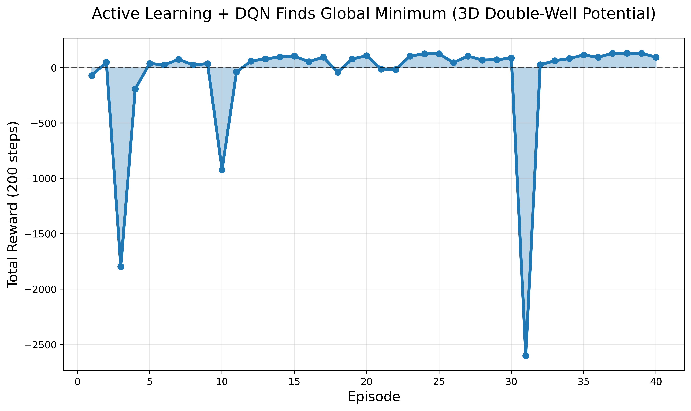
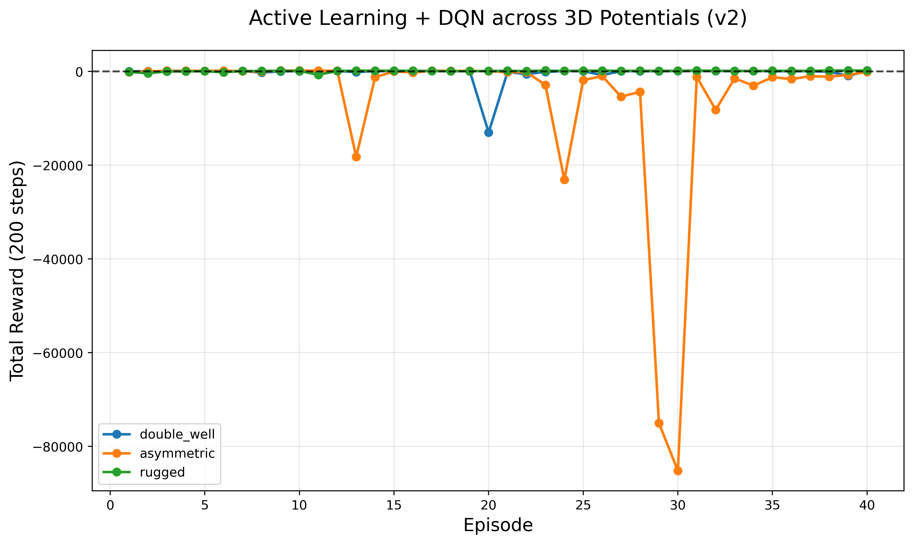
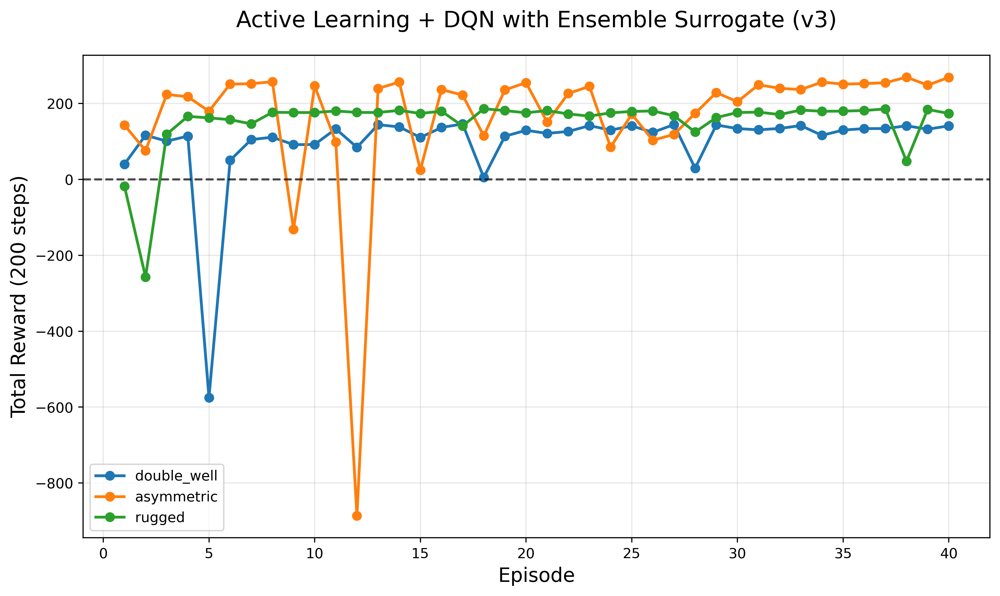

# **Active-Learning DQN for PES Optimization**

### **v1 → v2 → v3 Evolution: From Single-Surrogate RL to Ensemble-Stabilized Active Learning**

This repository contains the full development history of an active-learning reinforcement-learning engine designed to navigate **nonconvex potential energy surfaces (PES)** with extreme data efficiency.

The system evolves through **three versions**:

* **v1 — Single surrogate, 1 PES, bounded success.**
* **v2 — Multi-PES stress test reveals catastrophic OOD collapse.**
* **v3 — Ensemble uncertainty + OOD guard fixes the failure and stabilizes all PES.**

The latest version (v3) achieves **96–97% oracle savings** across all evaluated potentials.

---

# **🔥 What This Repo Demonstrates**

### A discrete-action Deep Q-Network (DQN) can solve rugged PES landscapes while calling the true oracle only when absolutely necessary.

Across 40×200-step episodes, the system uses only:

* **200 QM calls** on the symmetric double-well
* **224 QM calls** on the rugged double-well
* **299 QM calls** on the asymmetric tilted double-well

A full run would normally require **8000 exact evaluations**.

---

# **📘 Version History (v1 → v2 → v3)**

## **v1 — Single Surrogate Succeeds (But Only on Bounded PES)**

* One Neural Force Field (NFF) guides the DQN.
* Only 199 QM calls used.
* Works on the symmetric 3D double-well.
* Appears “solved”… until larger tests reveal the flaw.

**Figure (v1):**


---

## **v2 — Multi-Potential Testing Exposes the Fatal Flaw**

v2 runs the same agent on three PES types:

1. Symmetric double-well
2. Asymmetric tilted double-well (unbounded on one side)
3. Rugged double-well (sinusoidal roughness)

The asymmetric PES causes **catastrophic surrogate overconfidence**:

* Surrogate confidently predicts wrong values
* No uncertainty spike → no QM correction
* Rewards crash below **−80,000**

**Figure (v2):**


This reveals that **single-surrogate RL is unsafe** on real chemistry landscapes.

---

## **v3 — Ensemble Epistemic Uncertainty + OOD Guard (Fixes Everything)**

v3 introduces two key stabilizers:

1. **Five-model NFF ensemble**

   * Epistemic uncertainty = prediction disagreement
   * Correctly identifies OOD states
2. **Radial OOD Guard**

   * If ‖r‖ > 2.8 → force QM evaluation to avoid collapse

This combination **completely eliminates v2 failures**.

**Figure (v3):**


v3 can **recover** from negative reward dips and steer back to optimal regions—
a capability that v1/v2 completely lacked.

---

# **📄 Paper (Updated v1 → v2 → v3 Story)**

The full versioned paper is included here:

**`active-dqn-doublewell.pdf`**

It explains the scientific story behind the three versions, the discoveries along the way, and why v3 finally becomes robust enough for real PES optimization.

You can cite it using:

```bibtex
@article{DABSDynamics2025ActiveDQN,
  title={From Single-Surrogate RL to Ensemble-Stabilized Active Learning: 
         A Versioned Journey Toward Robust PES Optimization with 96--97\% Oracle Savings},
  author={Stoner},
  journal={Independent Research},
  year={2025},
  month={December}
}
```

---

# **📦 Repository Structure**

```
active-dqn-doublewell/
│
├── ALD_DQND.py          # Version 1 (single surrogate)
├── ALD_DQND_v2.py       # Version 2 (multi-PES testing)
├── ALD_DQND_v3.py       # Version 3 (ensemble + OOD guard)
│
├── reward_curve_v1.png
├── reward_curves_v2.png
├── reward_curves_v3.png
│
├── active-dqn-doublewell.pdf   # Full paper (v1 → v2 → v3)
├── refs.bib                    # References for the PDF
│
└── LICENSE
```

---

# **⚙️ Installation**

```bash
git clone https://github.com/StonerIsh420/active-dqn-doublewell.git
cd active-dqn-doublewell
pip install tensorflow numpy matplotlib
```

Python 3.13 compatibility fixes are included.

---

# **🚀 Running the Models**

### **v1:**

```bash
python ALD_DQND.py
```

### **v2:**

```bash
python ALD_DQND_v2.py
```

### **v3 (recommended):**

```bash
python ALD_DQND_v3.py
```

Each script logs:

* Episode Reward
* Exploration ε
* Total QM Calls
* Surrogate vs Oracle usage

And writes the reward curves to `.png`.

---

# **🧠 Scientific Summary**

| Version | Strength                               | Weakness                  | Status                  |
| ------- | -------------------------------------- | ------------------------- | ----------------------- |
| **v1**  | Works on bounded PES                   | Unrealistic for chemistry | ✔️ Good baseline        |
| **v2**  | Multi-PES test suite                   | Catastrophic OOD collapse | ❌ Fatal flaw found      |
| **v3**  | Ensemble uncertainty, recovery-capable | Slightly more QM calls    | ⭐ **Robust + reliable** |

---

# **📬 Acknowledgments**

Thanks to **Grok (xAI)** and **Gemini (Google)** for debugging assistance and refinement support.
All conceptual design originates solely from the author.

---

# **📜 License**

MIT License. See `LICENSE`.

---